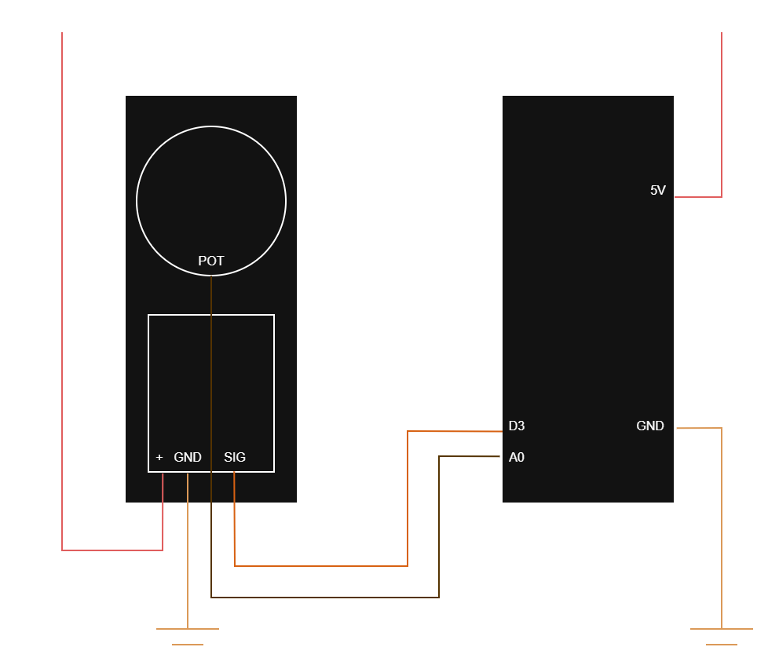

# CustomServo

A step-based, feedback-controlled servo library for Arduino. Built for a modified MG90S servo with its internal potentiometer wired out to an analog pin, giving real position feedback on every update cycle.

> **Status: Work in Progress**
The following are not yet implemented:
>- Function `calibrate()`. Hardcoded calibration values are required for now (see [Calibration](#calibration)). 
>- Currently `update()` only runs one iteration, plan is to make it run until `targetAngle` is reached. (see `Moving to a Target and Waiting for Arrival` under [Usage](#usage))
>- Creating an interactive app to control and see real-time values of the Servo (maybe later)

---

## How It Works

Standard servo control (`servo.write(angle)`) snaps the motor to a position instantly, causing jerky motion. This library instead steps toward the target incrementally — moving `STEP_SIZE` degrees per `update()` call — while reading the potentiometer each step to confirm the actual shaft position before continuing.

```
loop() calls update(target)
         │
         ▼
Has STEP_INTERVAL_MS elapsed? ──No──► return (wait)
         │ Yes
         ▼
Read potentiometer → currentAngle
         │
         ▼
error = target - currentAngle
Within TOLERANCE? ──Yes──► return (at target)
         │ No
         ▼
commandedAngle += STEP_SIZE (toward target, never past)
         │
         ▼
servo.write(commandedAngle)
```

This approach gives smooth, controlled movement without overshoot.

---

## Hardware Setup




### Components
- Arduino Nano (or compatible AVR board)
- Modified MG90S servo with internal potentiometer tapped out
- Wiring:

| Component              | Arduino Pin        |
|------------------------|--------------------|
| Servo PWM signal       | D3 (PWM-capable)   |
| Servo potentiometer    | A0 (analog input)  |
| Servo GND              | GND                |
| Servo VCC              | 5V                 |

### Potentiometer Wiring
The MG90S internal potentiometer has three leads. Wire the two outer leads to **GND** and **5V**, and the wiper (centre lead) to **A0**. The voltage on the wiper varies with shaft angle and is read by `analogRead()`.

---

## Installation

Copy `CustomServo.h` and `CustomServo.cpp` into your sketch folder alongside `main.ino`. Both the standard `Servo.h` library (bundled with the Arduino IDE) and this library must be included:

```cpp
#include <Servo.h>
#include "CustomServo.h"
```

---

## Calibration

The potentiometer does not produce a full 0–1023 ADC range across the servo's 0–180° travel. You need to find the actual ADC values at each extreme and pass them to `begin()`.

**How to find your calibration values:**

Use `debug_sweep.ino` (or manually command the servo to 0° and 180° and read `analogRead(A0)` from Serial Monitor). Record the two readings:

```
0°   → analogRead = 78   → this is calibLow
180° → analogRead = 588  → this is calibHigh
```

These values are hardware-specific — measure them for your unit.

---

## Usage

### Basic Setup

```cpp
#include <Servo.h>
#include "CustomServo.h"

#define CALIBRATION_LOW  78
#define CALIBRATION_HIGH 588

CustomServo serv;

void setup()
{
    Serial.begin(9600);
    serv.begin(3, A0, CALIBRATION_LOW, CALIBRATION_HIGH);
}

void loop()
{
    // Call update() repeatedly — each call steps the servo one increment closer
    serv.update(90);
}
```

### Moving to a Target and Waiting for Arrival

`update()` is non-blocking and returns immediately each call. To wait until the servo has actually reached a position:

```cpp
void moveTo(uint8_t angle)
{
    while (!serv.isAtTarget())
    {
        serv.update(angle);
        delay(10);
    }
}
```

### Sweep Example

```cpp
void loop()
{
    // Sweep from 0° to 180°, waiting at each degree until servo arrives
    for (int pos = 0; pos <= 180; pos++)
    {
        while (!serv.isAtTarget())
        {
            serv.update(pos);
        }
    }

    // Sweep back
    for (int pos = 180; pos >= 0; pos--)
    {
        while (!serv.isAtTarget())
        {
            serv.update(pos);
        }
    }
}
```

### Serial Monitor Control (from `main.ino`)

Type an angle (0–180) into the Serial Monitor and press Enter. The servo will step smoothly to that position.

---

## API Reference

### `void begin(uint8_t servoPin, uint8_t feedbackPin, int calibLow, int calibHigh)`
Initialises the servo. Attaches the PWM pin, sets pin modes, reads the starting position, and syncs internal state.

| Parameter     | Description                                 |
|---------------|---------------------------------------------|
| `servoPin`    | PWM-capable digital pin (e.g. D3)           |
| `feedbackPin` | Analog pin connected to potentiometer wiper |
| `calibLow`    | ADC reading at 0°                           |
| `calibHigh`   | ADC reading at 180°                         |

---

### `void update(uint8_t targetAngle)`
Steps the servo one increment toward `targetAngle`. Call this repeatedly in `loop()` — it returns immediately each call and rate-limits itself internally via `STEP_INTERVAL_MS`.

| Parameter     | Description                    |
|---------------|--------------------------------|
| `targetAngle` | Desired angle in degrees (0–180) |

---

### `uint8_t getCurrentAngle()`
Reads the potentiometer and returns the current shaft angle in degrees (0–180), mapped using the calibration values from `begin()`.

---

### `bool isAtTarget()`
Returns `true` if the current angle is within `TOLERANCE` degrees of the last commanded target.

---

## Tuning Constants

These are defined in `CustomServo.h`. Adjust them to suit your hardware:

| Constant           | Default | Description                                                                 |
|--------------------|---------|-----------------------------------------------------------------------------|
| `STEP_SIZE`        | `2`     | Degrees moved per `update()` call. Lower = smoother, slower.               |
| `STEP_INTERVAL_MS` | `10`    | Minimum milliseconds between steps. Lower = faster, but pot may not settle. |
| `TOLERANCE`        | `5`     | Acceptable error in degrees before considering the servo "at target".       |

---

## Troubleshooting

**Servo moves jerkily or overshoots**
Decrease `STEP_SIZE`. The step-based logic should never overshoot, but a large step size can feel abrupt.

**Servo moves too slowly**
Increase `STEP_SIZE` or decrease `STEP_INTERVAL_MS`. Be careful decreasing the interval too far, the potentiometer reading needs time to settle after each movement.

**Servo oscillates around the target**
Increase `TOLERANCE`. Some mechanical slop in the potentiometer coupling means the feedback reading may not be perfectly stable at rest.

**`isAtTarget()` never returns true**
Check that your calibration values are correct for your hardware. Run the debug sweep and verify the mapped angle matches the physical shaft position.

**Servo not moving at all**
- Verify wiring and power supply.
- Test the servo first with a bare `Servo.h` sketch to rule out hardware issues
- Confirm calibration values are not inverted (`calibLow` should be less than `calibHigh`)

**Serial input sets target to 0 unexpectedly**
Ensure your Serial Monitor is sending a newline character at the end (`\n`). The sketch uses `readStringUntil('\n')`. Also confirm you are sending a numeric string, not letters.

---

## Debug Output

The library currently prints step-by-step state to Serial on every `update()` call, if the `debug` flag is passed as `true`:

```C
servo.update(targetAngle, true); // default is debug = false

Output:
Target: 90 | Current: 45 | Error: 45 | Writing: 47
```

---

## License

Open source. Obviously. Use freely in your projects :)